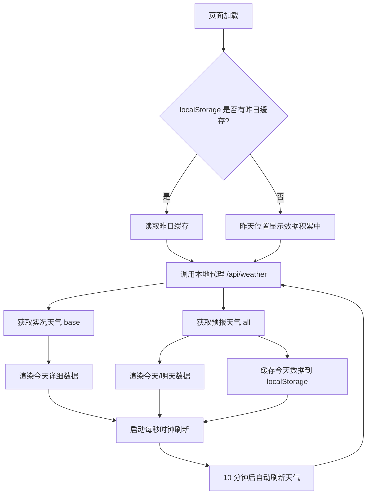

# 天气预报显示页面 PRD

## 1. 产品概述

一个面向小尺寸显示屏（15.5 × 8.5 cm）的天气信息展示页面，集成时间、日期（阳历 + 农历）、星期与天气预报，适用于桌面天气站、嵌入式屏幕（如树莓派显示屏）等场景。

- 目标用户：需要在小型显示屏上一目了然查看时间与天气的用户
- 核心价值：在有限的屏幕空间内优雅地呈现完整的时间与天气信息

## 2. 核心功能

### 2.1 功能模块

1. **时钟与日期区**：当前时间（时分秒）、阳历日期、农历日期、星期
2. **天气预报区**：昨天 / 今天 / 明天三日天气，今天为详细卡片，昨天和明天为精简卡片

### 2.2 页面详情

| 区域 | 模块 | 功能描述 |
|------|------|----------|
| 左侧 | 时间显示 | 大号字体显示 HH:MM:SS，每秒刷新 |
| 左侧 | 日期信息 | 阳历日期、农历日期（含生肖/干支可选）、星期几 |
| 右侧 | 今天详细 | 实况温度、天气现象、白天/夜间温度、风向风力、湿度、数据发布时间 |
| 右侧 | 昨天精简 | 日期、星期、天气现象、白天/夜间温度（来自本地缓存） |
| 右侧 | 明天精简 | 日期、星期、白天/夜间天气、白天/夜间温度、风向风力 |

### 2.3 关键说明

- **"昨天"数据来源**：高德天气 API 仅返回当天及未来 3 天数据，无法直接获取昨天天气。本方案使用 `localStorage` 缓存每日天气数据，每日首次加载时将"今天"的数据存入缓存，次日即可显示为"昨天"。首次使用时昨天位置显示"数据积累中"。
- **城市配置**：默认上海（adcode=310000），在页面右上角提供常用城市快速切换（北京/上海/广州/深圳/杭州）。
- **数据刷新**：时间每秒刷新；天气数据每 10 分钟自动刷新一次。

## 3. 核心流程

## 4. 用户界面设计

### 4.1 设计风格

- **整体风格**：精致天文台 / 气象站美学，深色背景配温暖琥珀色高亮，营造夜间时钟氛围
- **主色调**：深夜蓝黑色背景 `#0d1117` → `#161b22` 渐变；强调色琥珀金 `#f0b429`；次要文字 `#c9d1d9`
- **字体**：时间使用极具辨识度的衬线/等宽显示字体（如 `Major Mono Display` 或 `Cormorant`），数据使用清晰的无衬线字体（如 `Noto Sans SC`）
- **布局**：左右双栏，左栏时钟日期，右栏天气；今天卡片为视觉重心，昨天/明天为辅助卡片
- **动效**：页面加载时元素错落淡入；时钟数字平滑过渡；天气图标轻微脉动；避免持续闪烁干扰

### 4.2 页面设计概览

| 区域 | 模块 | UI 元素 |
|------|------|---------|
| 左栏 | 时间 | 超大号琥珀色等宽字体 HH:MM，下方小号 SS |
| 左栏 | 日期 | 阳历 YYYY年MM月DD日 + 农历 + 星期 |
| 右栏 | 今天 | 大卡片，居中温度大字，天气现象、风、湿度分行 |
| 右栏 | 昨天/明天 | 两个小卡片并排或上下排列 |

### 4.3 响应式

- 桌面优先，针对 15.5 × 8.5 cm 显示屏（约 1.82:1 宽高比）精确布局
- 页面填充 100vw × 100vh，使用 `clamp()` 与 `vmin` 单位适配不同分辨率
- 支持浏览器全屏模式（F11），适合嵌入式显示屏常驻展示

### 4.4 屏幕尺寸说明

15.5 × 8.5 cm 在典型 96 DPI 下约等于 586 × 321 像素，在 163 DPI（树莓派 7" 屏）下约等于 996 × 546 像素。设计采用相对单位，确保各分辨率下均可读。
