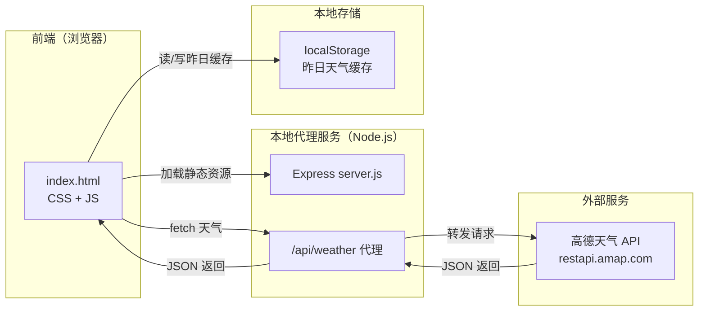

# 技术架构文档

## 1. 架构设计



## 2. 技术选型

- **前端**：原生 HTML5 + CSS3 + 原生 JavaScript（ES6+）
  - 选择原生而非 React：单页面展示型应用，需在嵌入式/低性能设备上流畅运行，无需构建步骤，加载快
- **农历转换**：`lunar-javascript`（通过 CDN 引入，纯前端 JS 库，无依赖）
- **后端**：Node.js + Express@4（仅作为高德 API 的 CORS 代理，轻量）
- **初始化工具**：`npm init` + 手动安装 express
- **无数据库**：使用浏览器 localStorage 缓存昨日天气

## 3. 目录结构

```
天气预报/
├── server.js              # Express 代理服务器
├── package.json
├── public/
│   ├── index.html         # 主页面
│   ├── styles.css         # 样式表
│   └── app.js             # 前端逻辑
└── .trae/
    └── documents/
        ├── PRD.md
        └── technical-architecture.md
```

## 4. API 定义

### 4.1 本地代理接口

**GET `/api/weather`**

| 参数 | 含义 | 必填 | 示例 |
|------|------|------|------|
| city | 城市 adcode | 是 | 310000 |
| extensions | 气象类型 base/all | 是 | all |

**响应**：原样转发高德 API 返回的 JSON。

### 4.2 高德 API 调用示例

```
GET https://restapi.amap.com/v3/weather/weatherInfo?key=3344ed5c6658e919e5e14aecf1bf96e9&city=310000&extensions=all
```

- **base 返回 `lives`**：实况天气（温度、天气、风向、风力、湿度、reporttime）
- **all 返回 `forecasts[0].casts`**：4 天预报数组
  - `casts[0]` = 今天，`casts[1]` = 明天，`casts[2]` = 后天，`casts[3]` = 大后天
  - 每个 cast 含：date、week、dayweather、nightweather、daytemp、nighttemp、daywind、nightwind、daypower、nightpower

## 5. 关键实现逻辑

### 5.1 昨日天气缓存策略

```javascript
// 伪代码
const today = casts[0];
const cacheKey = `weather_${today.date}`;
localStorage.setItem(cacheKey, JSON.stringify(today));

// 读取昨天
const yesterdayDate = getDateOffset(today.date, -1);
const yesterdayCache = localStorage.getItem(`weather_${yesterdayDate}`);
```

### 5.2 时钟刷新

- `setInterval(updateClock, 1000)` 每秒更新时间显示
- `setInterval(fetchWeather, 10 * 60 * 1000)` 每 10 分钟刷新天气

### 5.3 CORS 代理

```javascript
// server.js 核心逻辑
app.get('/api/weather', async (req, res) => {
  const { city, extensions } = req.query;
  const url = `https://restapi.amap.com/v3/weather/weatherInfo?key=${API_KEY}&city=${city}&extensions=${extensions}`;
  const data = await fetch(url).then(r => r.json());
  res.json(data);
});
```

## 6. 启动方式

```bash
npm install
node server.js
# 访问 http://localhost:3000
```
